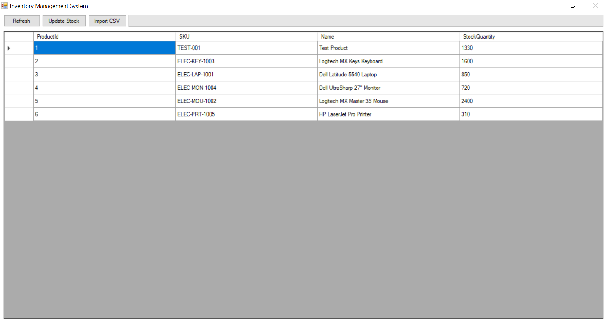
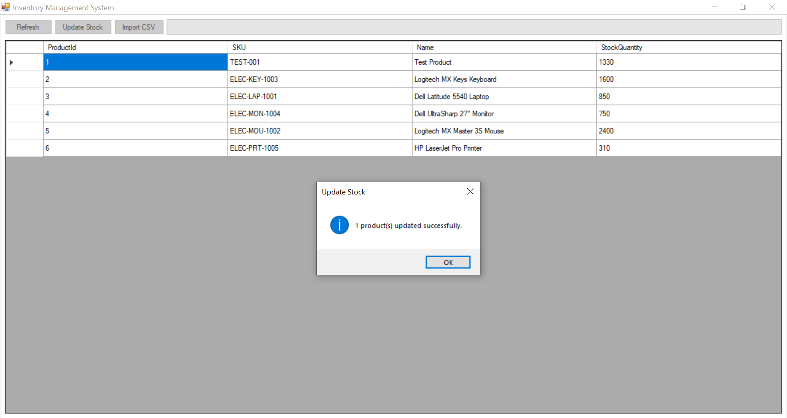
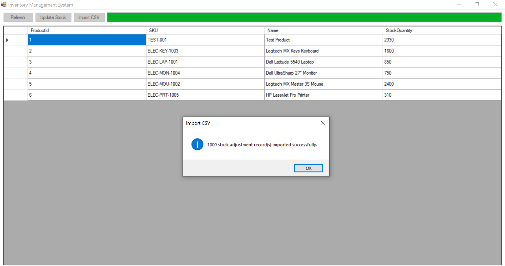
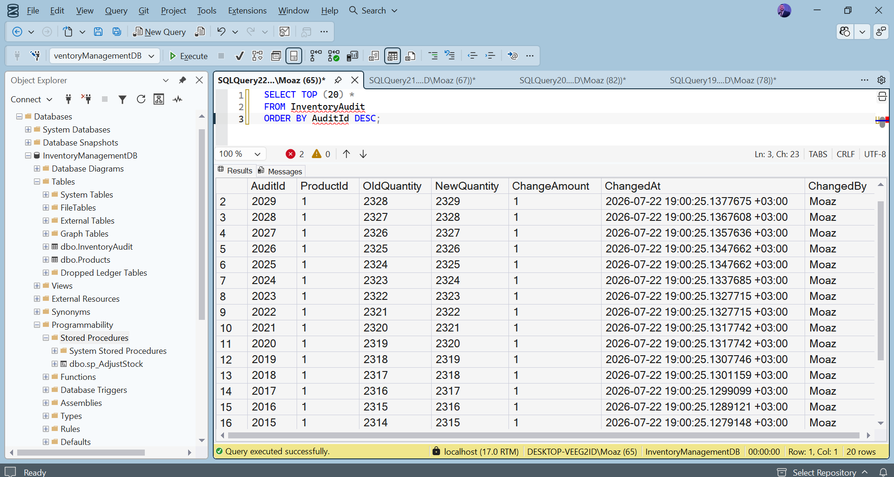
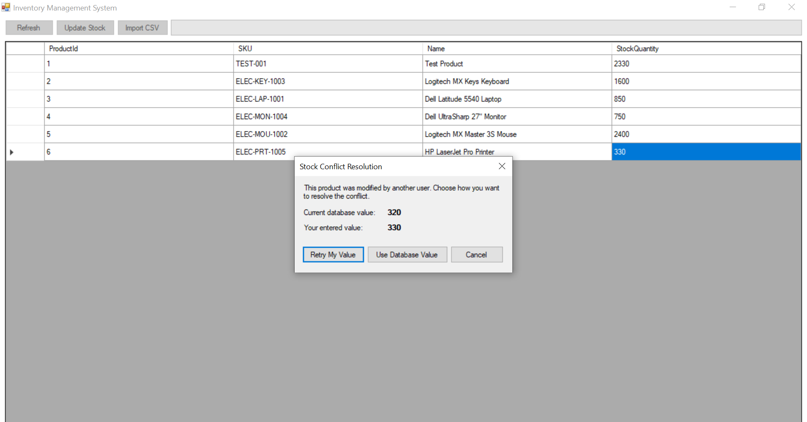

# High-Throughput Inventory & Audit Log Management System

A Windows Forms (.NET Framework 4.8) desktop application for inventory management with Microsoft SQL Server integration, optimistic concurrency control, immutable audit logging, and asynchronous bulk CSV import.

---

## Features

- Product inventory management
- SQL Server integration
- Repository Pattern (Separation of Concerns)
- Stored Procedure (`sp_AdjustStock`)
- Explicit SQL Transactions
- Immutable Inventory Audit Log
- Optimistic Concurrency using SQL Server `RowVersion`
- Conflict Resolution Dialog
- Async/Await database operations
- Bulk CSV Import
- Progress Bar during long-running imports

---

## Technology Stack

- C#
- .NET Framework 4.8
- Windows Forms (WinForms)
- Microsoft SQL Server
- ADO.NET
- T-SQL

---

## Database Structure

### Products

- ProductId
- SKU (Unique)
- Name
- StockQuantity
- RowVersion

### InventoryAudit

- AuditId
- ProductId
- OldQuantity
- NewQuantity
- ChangeAmount
- ChangedAt
- ChangedBy

---

## Project Structure

```
InventoryManagement
│
├── Data
├── Database
│   └── Scripts
├── Forms
├── Models
├── Repositories
├── Services
└── Properties
```

---

## Setup

1. Execute the SQL scripts in order:

```
Database/Scripts/01_CreateDatabase.sql
Database/Scripts/02_CreateTables.sql
Database/Scripts/03_CreateStoredProcedures.sql
```

2. Update the connection string inside:

```
App.config
```

Example:

```xml
<connectionStrings>
  <add
      name="InventoryDb"
      connectionString="Data Source=YOUR_SERVER;
                        Initial Catalog=InventoryManagementDB;
                        Integrated Security=True;
                        TrustServerCertificate=True"
      providerName="System.Data.SqlClient"/>
</connectionStrings>
```

3. Open:

```
InventoryManagement.sln
```

4. Build and Run.

---

## CSV Format

```csv
ProductId,ChangeAmount
1,10
1,-5
2,20
```

---

## Implemented Requirements

-  Database Schema
-  Stored Procedure (`sp_AdjustStock`)
-  SQL Transactions
-  Audit Logging
-  Repository Pattern
-  Async/Await
-  Optimistic Concurrency
-  Conflict Resolution
-  DataGridView Inline Editing
-  Background CSV Import
-  Progress Reporting

---

Developed as part of a technical evaluation task.

# Inventory Management System

A high-throughput inventory and audit-log management system built as a C# WinForms desktop application on .NET Framework 4.8. The system manages product stock levels with optimistic concurrency control, full audit logging of every stock change, and asynchronous bulk CSV import with progress reporting.

## Project Overview

The application provides a single-window operator UI for viewing products, adjusting stock quantities, and importing bulk stock adjustments from CSV files. Every stock change is applied through a stored procedure that enforces optimistic concurrency (via SQL Server `ROWVERSION`) and writes an immutable audit trail row, so the system remains correct under concurrent multi-user access without locking rows for the duration of a UI edit.

## Features

- **Product grid** — displays all products (`ProductId`, `SKU`, `Name`, `StockQuantity`) loaded asynchronously from SQL Server.
- **Editable stock quantity** — only the `StockQuantity` column is editable in the grid; identity and descriptive columns are read-only.
- **Optimistic concurrency** — stock updates are versioned with SQL Server `ROWVERSION`. If another user changed the row first, the update is rejected and the operator is shown a conflict-resolution dialog instead of silently overwriting data.
- **Conflict resolution dialog** — lets the operator choose to keep the current database value or retry their own change against the latest row version.
- **CSV bulk import** — imports `ProductId, ChangeAmount` records from a CSV file and applies each as a stock adjustment, with a progress bar reporting percentage completion.
- **Inventory audit log** — every successful stock adjustment (manual or CSV-imported) is recorded in `dbo.InventoryAudit` with the old quantity, new quantity, change amount, timestamp, and the user who made the change.
- **Refresh** — reloads products from SQL Server and refreshes the DataGridView.

## Architecture

The application follows a layered structure with a clear separation between UI, data access, and services:

- **Forms (UI layer)** — `MainForm` hosts the product grid and orchestrates user actions; `UpdateStockForm` is the modal conflict-resolution dialog shown when a concurrency conflict is detected.
- **Repository pattern** — `ProductRepository` is the sole data-access entry point for products and stock adjustments. All database access goes through ADO.NET (`SqlConnection` / `SqlCommand`), with no ORM.
- **Services** — `CsvImportService` parses and validates stock-adjustment CSV files independently of the data layer.
- **Models** — plain data-transfer objects (`Product`, `InventoryAudit`, `StockAdjustmentRecord`) with no behavior.
- **Async/await throughout** — all database calls and CSV parsing are asynchronous (`Task`-based), keeping the UI thread responsive during bulk imports and grid refreshes. `IProgress<int>` is used to marshal progress updates back to the UI thread during import.
- **Business rules are enforced inside SQL Server through dbo.sp_AdjustStock...** — concurrency checks, quantity validation, and audit-row insertion are implemented in the `dbo.sp_AdjustStock` stored procedure and executed within a single transaction, not in application code.

## Database

SQL Server database: `InventoryManagementDB`.

### Tables

- **`dbo.Products`** — `ProductId` (IDENTITY, PK), `SKU` (unique), `Name`, `StockQuantity` (non-negative, enforced by a `CHECK` constraint), `RowVersion` (`ROWVERSION`, used for optimistic concurrency).
- **`dbo.InventoryAudit`** — `AuditId` (IDENTITY, PK), `ProductId` (FK to `Products`), `OldQuantity`, `NewQuantity`, `ChangeAmount`, `ChangedAt`, `ChangedBy`.


## Assumptions

- SQL Server is installed locally.
- Windows environment.
- .NET Framework 4.8 is installed.
- User has permission to execute SQL scripts.

### Stored Procedure

- **`dbo.sp_AdjustStock`** — the only path by which stock quantities change. Within a single transaction it:
  1. Reads the current quantity and row version for the product.
  2. Throws error `50001` if the product doesn't exist.
  3. Throws error `50002` if the supplied row version doesn't match the current row version (concurrency conflict).
  4. Throws error `50003` if the adjustment would drive the quantity negative.
  5. Updates `StockQuantity`, guarded by an additional `WHERE RowVersion = @RowVersion` check.
  6. Inserts a corresponding row into `dbo.InventoryAudit`.

## Technologies

- C# / WinForms
- .NET Framework 4.8
- Microsoft SQL Server
- ADO.NET (`System.Data.SqlClient`)
- T-SQL stored procedures
- Repository pattern
- Async/await, `IProgress<T>`

## Setup Instructions

1. **Create the database and schema.** Run the scripts in `Database/Scripts/` against your SQL Server instance, in order:
   - `01_CreateDatabase.sql` — creates the `InventoryManagementDB` database.
   - `02_CreateTables.sql` — creates `dbo.Products` and `dbo.InventoryAudit`.
   - `03_CreateStoredProcedures.sql` — creates `dbo.sp_AdjustStock`.
2. **Seed sample data (optional, safe to re-run).** Run `04_SeedProducts.sql` to populate `dbo.Products` with a set of realistic sample products. This script is a `MERGE` keyed on `SKU`: it inserts products that don't exist and updates `Name`/`StockQuantity` for ones that do, without touching `ProductId`, `RowVersion`, or `InventoryAudit`.
3. **Configure the connection string.** Update the connection string in `App.config` to point at your SQL Server instance.
4. **Build and run.** Open the solution in Visual Studio (or build via MSBuild) targeting .NET Framework 4.8, then run `InventoryManagement.exe`.

## Screenshots

### Main Window

Displays the product grid with all current stock levels, loaded asynchronously on startup.



### Update Stock

Editing the `StockQuantity` column and submitting changes for one or more products.



### CSV Import

Importing bulk stock adjustments from a CSV file, with progress reported during the asynchronous batch operation.



### Audit Log

Every stock adjustment recorded in `dbo.InventoryAudit`, including old/new quantities, change amount, timestamp, and user.



### Concurrency Conflict

The conflict-resolution dialog shown when a stock update's row version no longer matches the database, letting the operator choose to accept the current database value or retry their change.



## Optimistic Concurrency

Rather than locking a product row while an operator has it open for editing, the system uses SQL Server `ROWVERSION` for optimistic concurrency:

1. When the grid loads, each `Product` carries its current `RowVersion`.
2. On save, `UpdateStockAsync` sends the original `RowVersion` to `dbo.sp_AdjustStock` along with the desired change amount.
3. The stored procedure compares the supplied `RowVersion` against the current one. A mismatch (error `50002`) means another user updated the row in the meantime.
4. The UI catches this specific SQL error, re-fetches the current product state, and shows `UpdateStockForm` so the operator can decide whether to keep the database's value or retry their own change against the latest row version.

This keeps writes safe under concurrent access without holding database locks across user think-time.

## CSV Import Details

`CsvImportService` reads a two-column CSV (`ProductId`, `ChangeAmount`), validating the header and each row before any database call is made. `ProductRepository.ImportStockAdjustmentsAsync` then applies each record as a stock adjustment through the same `dbo.sp_AdjustStock` procedure used by manual edits — so imported changes are subject to the identical concurrency checks, quantity validation, and audit logging as interactive updates. Progress is reported back to the UI via `IProgress<int>` as each record is processed, driving the progress bar without blocking the UI thread.

## Audit Logging

Every successful call to `dbo.sp_AdjustStock` — whether triggered from the grid or from a CSV import — inserts one row into `dbo.InventoryAudit` in the same transaction as the stock update. This guarantees the audit trail can never drift out of sync with `dbo.Products`: either both the stock update and the audit row commit, or neither does.

## Project Structure

```text
InventoryManagement/
├── Data/
│   └── SqlConnectionFactory.cs        # Creates SqlConnection instances from the configured connection string
├── Database/
│   └── Scripts/
│       ├── 01_CreateDatabase.sql      # Creates the InventoryManagementDB database
│       ├── 02_CreateTables.sql        # Creates dbo.Products and dbo.InventoryAudit
│       ├── 03_CreateStoredProcedures.sql  # Creates dbo.sp_AdjustStock
│       └── 04_SeedProducts.sql        # Idempotent sample product seed (MERGE on SKU)
├── docs/
│   └── images/                        # Screenshots referenced in this README
├── Forms/
│   ├── MainForm.cs / .Designer.cs     # Main window: product grid, refresh, update stock, CSV import
│   └── UpdateStockForm.cs / .Designer.cs  # Concurrency conflict resolution dialog
├── Models/
│   ├── Product.cs
│   ├── InventoryAudit.cs
│   └── StockAdjustmentRecord.cs
├── Repositories/
│   └── ProductRepository.cs           # ADO.NET data access for products and stock adjustments
├── Services/
│   └── CsvImportService.cs            # CSV parsing and validation for bulk stock adjustments
└── Program.cs                         # Application entry point
```

User
   │
   ▼
MainForm
   │
   ▼
ProductRepository
   │
   ▼
dbo.sp_AdjustStock
   │
   ├── Update Products
   └── Insert InventoryAudit


## Notes

- All business rules affecting data integrity (concurrency checks, non-negative stock, audit trail) are enforced in `dbo.sp_AdjustStock`, not in application code — the C# layer is a thin, async orchestration layer over ADO.NET.
- `04_SeedProducts.sql` is safe to run multiple times; re-running it will not create duplicate products or disturb existing `ProductId`/`RowVersion` values.
- The application targets .NET Framework 4.8 and requires a reachable SQL Server instance with the schema and stored procedure described above.

